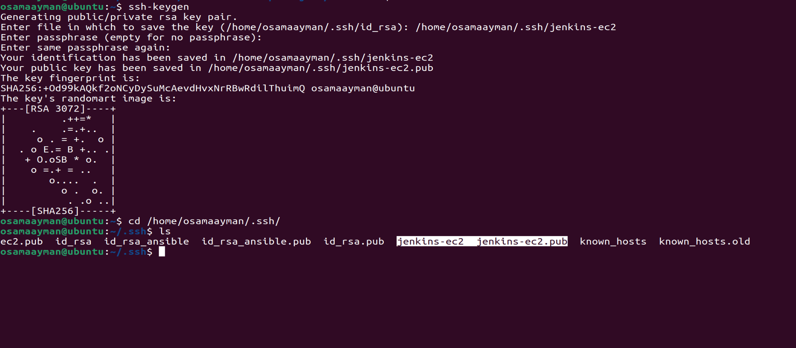
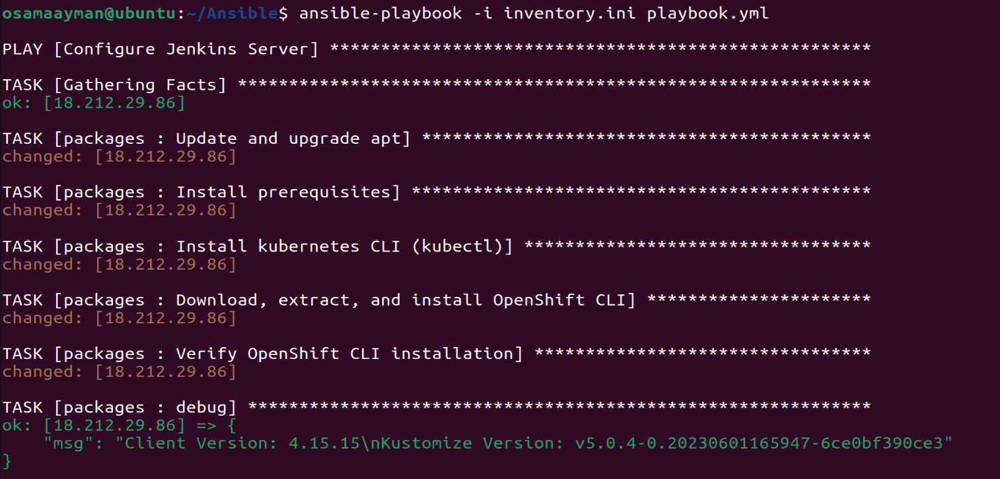
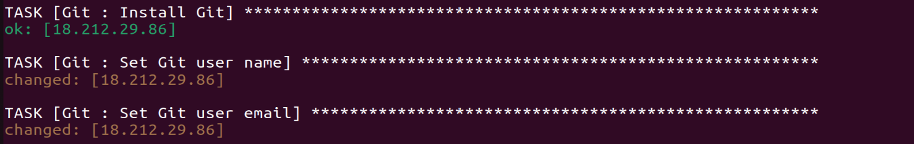
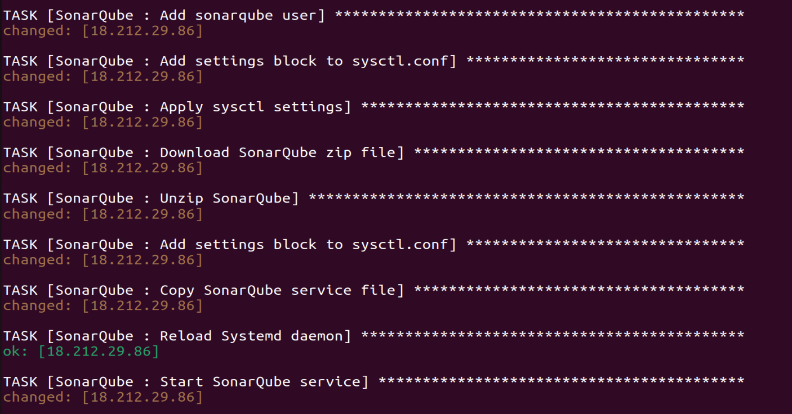
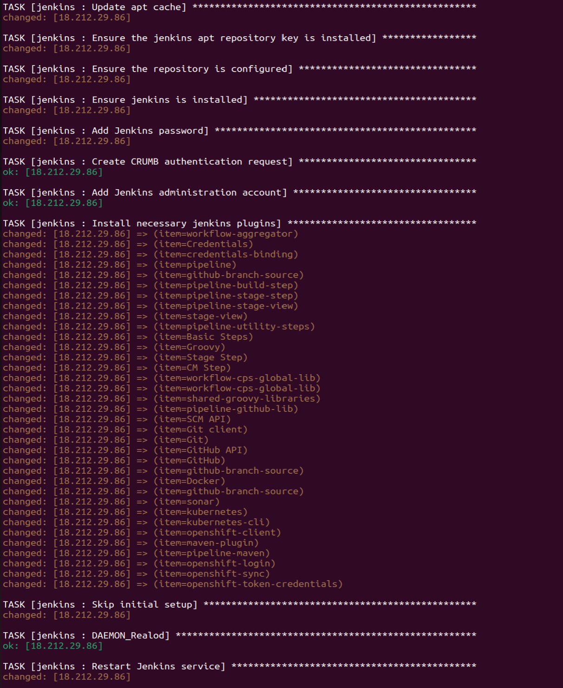
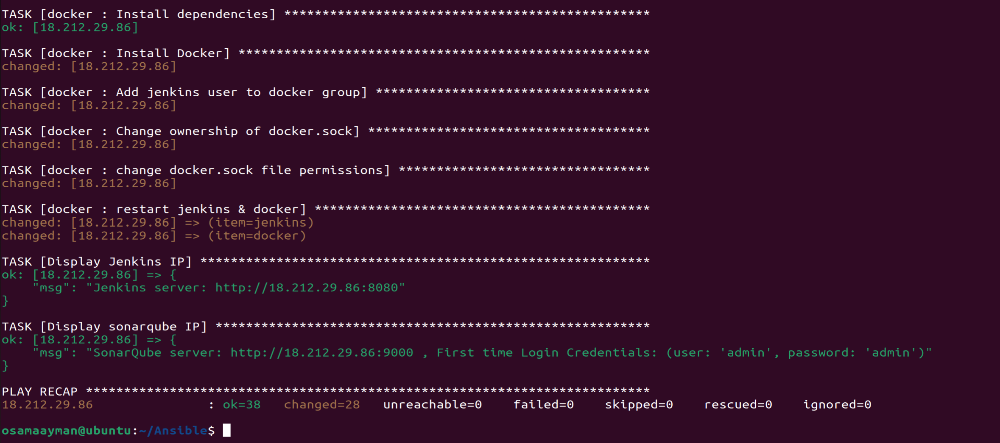

# Ansible Configuration for MultiCloudDevOpsProject

This section outlines the Ansible configuration used to set up the necessary environments on the EC2 instances provisioned by Terraform. Ansible is employed to automate the installation and configuration of various software components required for the Jenkins server, SonarQube, Docker, and other prerequisites.

## Project Structure

The Ansible configuration is organized into several roles, each responsible for a specific set of tasks:

1. **Packages Role**: Installs prerequisite packages such as `oc cli`, `jdk`, and `maven` for Jenkins.
2. **Git Role**: Installs and configures Git.
3. **Postgres Role**: Sets up PostgreSQL for SonarQube.
4. **SonarQube Role**: Installs and configures SonarQube.
5. **Jenkins Role**: Installs and configures Jenkins.
6. **Docker Role**: Installs and configures Docker.

## Directory Structure

```bash
ansible/
├── roles/
│   ├── packages/
│   │   ├── tasks/
│   │   │   └── main.yml
│   │   └── README.md
│   ├── git/
│   │   ├── tasks/
│   │   │   └── main.yml
│   │   ├── vars/
│   │   │   └── main.yml
│   │   └── README.md
│   ├── postgres/
│   │   ├── tasks/
│   │   │   └── main.yml
│   │   └── README.md
│   ├── SonarQube/
│   │   ├── tasks/
│   │   │   └── main.yml
│   │   ├── files/
│   │   │   └── sonarqube.service
│   │   └── README.md
│   ├── jenkins/
│   │   ├── tasks/
│   │   │   └── main.yml
│   │   ├── vars/
│   │   │   └── main.yml
│   │   └── README.md
│   ├── docker/
│   │   ├── tasks/
│   │   │   └── main.yml
│   │   └── README.md
├── playbook.yml
├── inventory.txt
├── ansible.cfg
└── README.md
```

## Roles

### Packages Role

Installs prerequisite packages necessary for Jenkins.

#### Tasks
- `main.yml`: Installs `oc cli`, `jdk`, and `maven`.


#### README
See the [Packages Role README](roles/packages/README.md) for detailed information.

### Git Role

Installs and configures Git.

#### Tasks
- `main.yml`: Installs Git and configures global settings.

#### vars
- `main.yml`: variables i use in tasks .

#### README
See the [Git Role README](roles/Git/README.md) for detailed information.

### Postgres Role

Sets up PostgreSQL for SonarQube.

#### Tasks
- `main.yml`: Installs PostgreSQL and sets up the database and user.

#### README
See the [Postgres Role README](roles/postgres/README.md) for detailed information.

### SonarQube Role

Installs and configures SonarQube.

#### Tasks
- `main.yml`: Installs SonarQube and configures it to use the PostgreSQL database.

#### files
- `sonarqube.service`: establis a configuration of SonarQube service.

#### README
See the [SonarQube Role README](roles/SonarQube/README.md) for detailed information.

### Jenkins Role

Installs and configures Jenkins.

#### Tasks
- `main.yml`: Installs Jenkins, configures security, and sets up initial jobs.

#### vars
- `main.yml`: variables of account and email .

#### README
See the [Jenkins Role README](roles/jenkins/README.md) for detailed information.

### Docker Role

Installs and configures Docker.

#### Tasks
- `main.yml`: Installs Docker and configures it to allow users to run Docker without `sudo`.


#### README
See the [Docker Role README](roles/docker/README.md) for detailed information.

## Playbooks

The main playbook (`playbook.yml`) orchestrates the execution of all roles to configure the EC2 instance.

## Inventory

The inventory file (`inventory.txt`) defines the hosts and groups of hosts on which the playbooks will run.

## Usage

To execute the Ansible playbook, run the following command:

```bash
ansible-playbook -i inventory.txt playbook.yml
```

This command will apply all the roles to the specified hosts, ensuring that the EC2 instances are properly configured with all necessary software and settings.

## ScreenShots










