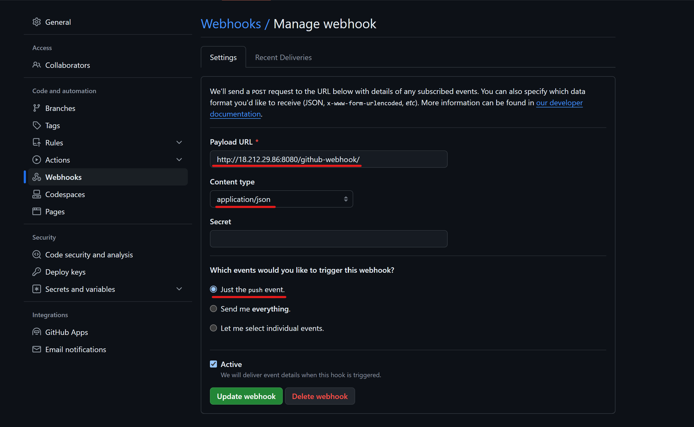
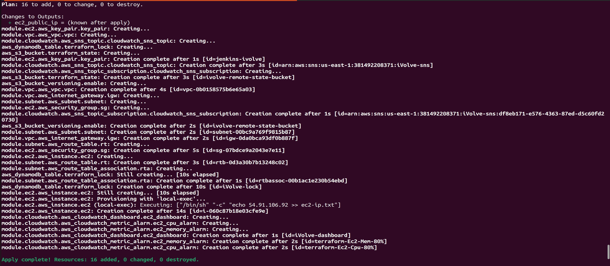

# MultiCloudDevOpsProject

This project demonstrates a comprehensive DevOps pipeline that integrates Terraform for infrastructure provisioning, Ansible for configuration management, Docker for containerization, Jenkins for continuous integration, and OpenShift for deployment. The pipeline automates the deployment of a sample application to OpenShift, ensuring a streamlined and efficient workflow. Additionally, it integrates monitoring and logging, as well as AWS services.

## Project Archticture 


## Project Structure
```
├── Ansible
├── app
├── OpenShift
├── screenshots
├── scripts
├── Terraform
├── jenkinsfile
└── README.md
```
## Table of Contents

1. [Repository Setup](#repository-setup)
2. [Infrastructure Provisioning](#infrastructure-provisioning)
3. [Configuration Management](#configuration-management)
4. [Containerization](#containerization)
5. [Automated Deployment Pipeline](#automated-deployment-pipeline)
6. [AWS Integration](#aws-integration)
7. [Running the Automated Deployment Script](#running-the-automated-deployment-script)
8. [Documentation](#documentation)

## Prerequisites
Before using this project, ensure that you have the following prerequisites:

- Docker: For building and managing containerized applications.
- Kubernetes/OpenShift: For orchestrating containerized applications.
- Jenkins: For implementing continuous integration and continuous deployment (CI/CD) pipelines.
- Docker Hub Account: For storing Docker images.
- Git: For version control and cloning the project repository.


## Repository Setup

### Initial Configuration

1. **Create and Clone the Repository:**
   - Create a new repository named "MultiCloudDevOpsProject" on GitHub.
   - Clone the repository to your local machine to get started:
     ```
     git clone https://github.com/Osamaomera/MultiCloudDevOpsProject.git
     ```

2. **Branching:**
   - **Main Branch:** Contains the production-ready code.
   - **Dev Branch:** Used for ongoing development work.
  
3. **Branch Creation:**
   - Create a development branch named `dev` for ongoing changes:
     ```
     git checkout -b dev
     git push origin dev
     ```

By following these steps, you'll have a structured repository for your DevOps project, with separate branches for development and production-ready code.


## Infrastructure Provisioning
### Task:

Provision AWS infrastructure for this project is provisioned using Terraform. It includes the following modules:
- EC2 Module
- VPC Module
- Subnet Module
- CloudWatch Module

### Deliverables:

1. **Terraform Scripts**: 
   - The Terraform scripts should be developed and committed to the repository provided.
   - These scripts will define the infrastructure as code, enabling reproducible and version-controlled infrastructure provisioning.

2. **Use of Terraform Modules**:
   - Modularization of Terraform code is encouraged to promote reusability, maintainability, and readability.
   - Utilize Terraform modules for managing different components of the infrastructure, such as VPC, Subnets, Security Groups, and EC2 instances

**For detailed information, refer to the [Terraform README](Terraform/README.md)**.

## Configuration Management

### Tasks
the objective of Configuration management which is handled by Ansible it's playbooks configure the EC2 instance by installing the required software and setting up necessary environment variables. The roles included are:

- `packages` role for prerequisites like `oc cli`, `jdk`, and `maven`
- `git` role
- `postgres` role for SonarQube
- `sonarqube` role
- `jenkins` role
- `docker` role

### Deliverables
- Ansible playbooks committed to the repository.
- Use Ansible roles.

#### Example Ansible Playbook
**[Ansible PlayBook ](Ansible/playbook.yml)**

**For detailed information, refer to the [Ansible README](Ansible/README.md)**.

## Containerization
Containerization plays a crucial role in this project's architecture, facilitating efficient deployment and management of applications. Docker is the primary tool used for containerization.

### Task
- Deliver Dockerfile for building the application image.

 Below are the key components and tasks related to containerization:

- **Dockerfile:**
  - A Dockerfile is provided to build the application image. It includes instructions on how to package the application and its dependencies into a Docker container.

    ### Dockerfile
    [Docker File Of Application ](app/Dockerfile)

- **Image Repository:**
  - The Docker image is pushed to a container registry, such as Docker Hub or a private registry, for storage and distribution.

- **Container Deployment:**
  - The Docker image is deployed as containers on the target environment, ensuring consistent and isolated execution of the application.

### Deliverables
- Dockerfile committed to the repository.


## Automated Deployment Pipeline

### Task
- Deliver Jenkins pipeline configuration in Jenkinsfile with stages:
  - Git Checkout
  - Run Unit Test
  - Run Code Compile
  - Run SonarQube Analysis
  - Build Docker Image
  - Push Docker Image
  - Deploy on OpenShift

### Deliverables
- Jenkins pipeline configured in the Jenkinsfile.

Certainly! Here is a step-by-step guide to creating an automated deployment pipeline on Jenkins using a Jenkinsfile. The pipeline will include stages for Git checkout, running unit tests, compiling code, running SonarQube analysis, building a Docker image, pushing the Docker image to a registry, and deploying the application on OpenShift.


## Introduction

This guide provides detailed instructions on setting up an automated deployment pipeline on Jenkins. The pipeline includes stages for:
- Git Checkout
- Running Unit Tests
- Code Compilation
- SonarQube Analysis
- Building Docker Image
- Pushing Docker Image
- Deploying on OpenShift

## Prerequisites

Before setting up the pipeline, ensure you have the following:
1. Jenkins installed and running.
2. Required plugins installed on Jenkins: 
(**which installed by ansible in Configuration Managment [Ansible README](Ansible/README.md) for your review** )
   - Git Plugin
   - Pipeline Plugin
   - Docker Pipeline Plugin
   - SonarQube Plugin
3. A configured SonarQube server.
4. Docker installed and configured on Jenkins.
5. Access to a Docker registry (e.g., Docker Hub).
6. OpenShift cluster with appropriate permissions.

## Steps to Configure the Pipeline

### 1. Install Required Jenkins Plugins

Ensure the following plugins are installed on your Jenkins instance:
- Git Plugin
- Pipeline Plugin
- Docker Pipeline Plugin
- SonarQube Plugin

### 2. Configure SonarQube in Jenkins

1. Go to Jenkins Dashboard.
2. Click on "Manage Jenkins" > "Configure System".
3. Scroll down to "SonarQube servers" and click on "Add SonarQube".
4. Add your SonarQube server details and authentication token.


### 3. Create Jenkins Credentials

1. Go to Jenkins Dashboard.
2. Click on "Manage Jenkins" > "Manage Credentials".
3. Add credentials for:
   - Docker Registry (username and password).
   - AWS (Access Key and Secret Key) if deploying on AWS.
   - OpenShift (token if required).
  
  

### 4. Configure Shared Library in Jenkins

1. Go to Jenkins Dashboard.
2. Click on "Manage Jenkins" > "Configure System".
3. Scroll down to "Global Pipeline Libraries" and click on "Add".
4. Enter the following details:
   - Name: `shared_library`
   - Default version: `main` (or the default branch of your shared library)
   - Retrieval method: Modern SCM
   - Select "Git" and provide the repository URL of your shared library: https://github.com/Osamaomera/shared_library_ivolve.git.
   - Add credentials if required.
5. Click "Save".


### 5. Create a Jenkins Pipeline Job

1. Go to Jenkins Dashboard.
2. Click on "New Item".
3. Enter the job name and select "Pipeline".
4. Click "OK" to create the job.

### WebHook in Github





### 6. Configure Jenkinsfile in Your Repository

  **[My Jenkins File ](jenkinsfile)**

Add a `Jenkinsfile` to the root of your repository with the above pipeline script.

### 8. Trigger the Pipeline

1. Go to the Jenkins job you created.
2. Click on "Build Now" to trigger the pipeline.
3. Monitor the pipeline execution through the Jenkins dashboard.


### Check the SonarQube for Code 


## The Image Pushed to DockerHub


### The App Deployed in OpenShift


### Access the App Url in Route


## AWS Integration

### Task
- Provide instructions for integrating AWS services:
  - Use S3 Terraform Backend state.
  - Use DynamoDB Terraform Lock state
  - Integrate CloudWatch for monitoring.

### Deliverables
- Instructions for AWS integration in the Terraform Code.

- **S3 Backend State**


- **DynamoDB Lock State**


- **Cloud Watch for Monitoring Ec2** 


## Running the Automated Deployment Script

This script automates the entire process of provisioning infrastructure with Terraform, updating the Ansible inventory, and running the Ansible playbook. It will then show the output of the deployed website on OpenShift.

### Script: `run.sh`

  **[Bash Script to Automate Installation](scripts/run.sh)**

### Steps to Run the Script

1. **Save the Script**:
   Save the script above to a file named `run.sh`.

2. **Make the Script Executable**:
   ```sh
   chmod +x run.sh
   ```

3. **Run the Script**:
   ```sh
   ./run.sh
   ```
  
  
  
  
  
  
  

### Output Verification

**After running the script, And After Jenkins Pipeline Finished** 
verify the output of the deployed website on OpenShift by accessing the application's URL which in route . The steps involved include:

1. **Access the OpenShift Console**:
   Navigate to your OpenShift web console and log in.


2. **Find the Route**:
   In your OpenShift project, locate the route created for your application. This will be in the `Networking > Routes` section.

   

3. **Open the Application URL**:
   Copy the URL provided in the route and paste it into your web browser to access the deployed application.

   


## Troubleshooting

### Common Issues
- **Disk Space Issues**: Ensure there is sufficient disk space on the Jenkins server.
- **Network Issues**: Verify network connectivity between the Jenkins server and the GitHub repository, Docker registry, and OpenShift cluster.
- **Permission Issues**: Check the permissions and credentials used for accessing AWS, DockerHub, and OpenShift.

### Useful Commands

Here are the useful commands for each tool used in this project, including Terraform, Ansible, Docker, and Jenkins.

#### Terraform Commands
- `terraform init`: Initialize the Terraform configuration.
- `terraform apply --auto-approve`: Apply the Terraform configuration to provision resources.
- `terraform destroy --auto-approve`: Destroy the Terraform-managed infrastructure.

#### Ansible Commands
- `ansible-playbook -i inventory playbook.yml`: Run an Ansible playbook.
- `ansible-inventory -i inventory --list`: List inventory hosts and variables.
- `ansible-vault encrypt playbook.yml`: Encrypt an Ansible playbook.
- `ansible-vault decrypt playbook.yml`: Decrypt an Ansible playbook.
- `ansible-vault view playbook.yml`: View an encrypted Ansible playbook.

#### Docker Commands
- `docker build -t myapp .`: Build a Docker image.
- `docker push myapp`: Push a Docker image to the registry.
- `docker run -p 8080:8080 myapp`: Run a Docker container from an image.
- `docker login`: Log in to a Docker registry.
- `docker tag myapp:latest myapp:v1.0.0`: Tag a Docker image.

#### OpenShift Commands
- `oc apply -f deployment.yml`: Apply a Kubernetes deployment configuration.
- `oc get pods`: List all pods in the Kubernetes cluster.
- `oc get services`: List all services in the Kubernetes cluster.
- `oc describe pod <pod-name>`: Describe a specific pod.
- `oc logs <pod-name>`: Fetch the logs of a pod.

### Setting Up and Running the Pipeline

#### 1. Setting Up Terraform
```sh
# Navigate to the Terraform directory
cd /home/osamaayman/Documents/MultiCloudDevOpsProject/Terraform

# Initialize the Terraform configuration
terraform init

# Apply the Terraform configuration to provision resources
terraform apply --auto-approve
```

#### 2. Updating Ansible Inventory
```sh
# Extract the EC2 IP address and update the inventory file
ip_address=$(cat ec2-ip.txt)
echo -e "jenkins-ec2 ansible_host=${ip_address} ansible_user=ubuntu ansible_ssh_private_key_file=/path/to/your/private/key.pem" > /home/osamaayman/Documents/MultiCloudDevOpsProject/Ansible/inventory.txt
```

#### 3. Running Ansible Playbook
```sh
# Navigate to the Ansible directory
cd /home/osamaayman/Documents/MultiCloudDevOpsProject/Ansible

# Run the Ansible playbook
ansible-playbook -i inventory.txt playbook.yml --ask-vault-pass
```

#### 4. Docker Commands
```sh
# Build the Docker image
docker build -t myapp .

# Push the Docker image to the registry
docker push myapp
```

## Documentation 

| Resource                         | Link                                                                                       |
|----------------------------------|--------------------------------------------------------------------------------------------|
| Ansible Documentation            | [Ansible Documentation](https://docs.ansible.com/)                                         |
| Ansible Galaxy                   | [Ansible Galaxy](https://galaxy.ansible.com/)                                              |
| Jenkins Documentation            | [Jenkins Documentation](https://www.jenkins.io/doc/)                                       |
| Docker Documentation             | [Docker Documentation](https://docs.docker.com/)                                           |
| Terraform Documentation          | [Terraform Documentation](https://www.terraform.io/docs/index.html)                        |
| SonarQube Documentation          | [SonarQube Documentation](https://docs.sonarqube.org/latest/)                               |
| OpenShift CLI Documentation      | [OpenShift CLI Documentation](https://docs.openshift.com/container-platform/latest/cli_reference/openshift_cli/getting-started-cli.html) |
| AWS EC2 Documentation            | [AWS EC2 Documentation](https://docs.aws.amazon.com/ec2/index.html)                        |