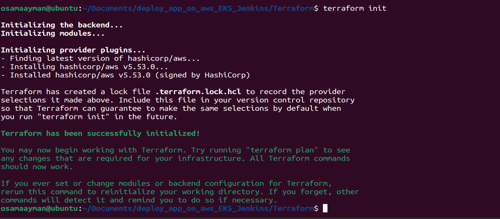

Here's a detailed README file for the Terraform use in your project:
# Terraform Infrastructure for MultiCloudDevOpsProject

## Overview

This Terraform configuration provisions the necessary AWS infrastructure to support a Jenkins server used for a DevOps pipeline. The infrastructure includes VPC, subnets, EC2 instances, and CloudWatch monitoring.

## Directory Structure

```
terraform/
├── ec2/
│   ├── main.tf
│   ├── outputs.tf
│   └──variables.tf
├── vpc/
│   ├── main.tf
│   ├── outputs.tf
│   └── variables.tf
├── subnet/
│   ├── main.tf
│   ├── outputs.tf
│   └── variables.tf
├── cloudwatch/
│   ├── main.tf
│   ├── outputs.tf
│   └── variables.tf
├── main.tf
├── remote_backend.tf
├── variables.tf
├── terraform.tfvars
└── README.md
```

## Modules

### VPC Module

#### Purpose
The VPC module creates a Virtual Private Cloud (VPC) in AWS to host your resources.

#### Files
- **main.tf**: Defines the VPC resource.
- **outputs.tf**: Outputs the VPC ID.
- **variables.tf**: Defines the input variables for the VPC.

#### Example Usage
```hcl
module "vpc" {
  source             = "./vpc"
  vpc_cidr           = var.vpc_cidr
}

```

### Subnet Module

#### Purpose
The subnet module creates public and private subnets within the VPC.

#### Files
- **main.tf**: Defines the subnet resources.
- **outputs.tf**: Outputs the subnet IDs.
- **variables.tf**: Defines the input variables for the subnets.

#### Example Usage
```hcl
module "subnet" {
  source             = "./subnet"
  vpc_id             = module.vpc.vpc_id
  subnet             = var.subnet
  igw_id             = module.vpc.igw_id
}
```

### EC2 Module

#### Purpose
The EC2 module provisions EC2 instances to host Jenkins.

#### Files
- **main.tf**: Defines the EC2 instance resources.
- **outputs.tf**: Outputs the instance IDs and public IP addresses.
- **variables.tf**: Defines the input variables for the EC2 instances.

#### Example Usage
```hcl
module "ec2" {
  source             = "./ec2"
  sg_vpc_id          = module.vpc.vpc_id
  public_key_path    = var.public_key_path
  ec2_ami_id	       = var.ec2_ami_id
  ec2_type  	       = var.ec2_type
  ec2_subnet_id      = module.subnet.subnet_id
}

```

### CloudWatch Module

#### Purpose
The CloudWatch module sets up monitoring for the EC2 instances.

#### Files
- **main.tf**: Defines the CloudWatch resources.
- **outputs.tf**: Outputs the CloudWatch dashboard and alarms.
- **variables.tf**: Defines the input variables for CloudWatch.

#### Example Usage
```hcl
module "cloudwatch" {
  source              = "./cloudwatch"
  ec2_id	            = module.ec2.ec2_id
  cloudwatch_region   = var.region
  sns_email	          = var.sns_email
}
```

## Usage Instructions

### Prerequisites

- Install [Terraform](https://www.terraform.io/downloads.html)
- AWS CLI configured with appropriate IAM permissions
- SSH key pair created in AWS (for EC2 access)

### Steps

1. **Initialize the Terraform configuration:**
   ```sh
   terraform init
   ```

2. **Plan the Terraform deployment:**
   ```sh
   terraform plan
   ```

3. **Apply the Terraform configuration:**
   ```sh
   terraform apply
   ```

4. **Destroy the Terraform infrastructure (when no longer needed):**
   ```sh
   terraform destroy
   ```

## Variables

### VPC Module

- `vpc_name` (string): The name of the VPC.
- `cidr_block` (string): The CIDR block for the VPC.

### Subnet Module

- `vpc_id` (string): The ID of the VPC.
- `public_subnet_cidr` (list): CIDR blocks for public subnets.
- `private_subnet_cidr` (list): CIDR blocks for private subnets.

### EC2 Module

- `instance_type` (string): The type of EC2 instance (e.g., `t2.medium`).
- `ami_id` (string): The ID of the AMI to use for the EC2 instance.
- `key_name` (string): The name of the SSH key pair.
- `vpc_security_group_ids` (list): The security group IDs to associate with the instance.
- `subnet_id` (string): The ID of the subnet to launch the instance in.

### CloudWatch Module

- `ec2_instance_ids` (list): The IDs of the EC2 instances to monitor.

## Outputs

### VPC Module

- `vpc_id`: The ID of the created VPC.

### Subnet Module

- `public_subnet_id`: The ID of the created public subnet.
- `private_subnet_id`: The ID of the created private subnet.

### EC2 Module

- `instance_ids`: The IDs of the created EC2 instances.
- `public_ips`: The public IP addresses of the created EC2 instances.

### CloudWatch Module

- `cloudwatch_dashboard_url`: The URL of the CloudWatch dashboard.
- `cloudwatch_alarms`: The created CloudWatch alarms.

## ScreenShots




